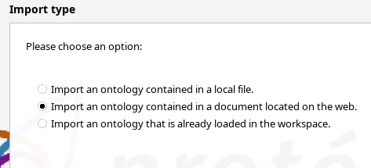
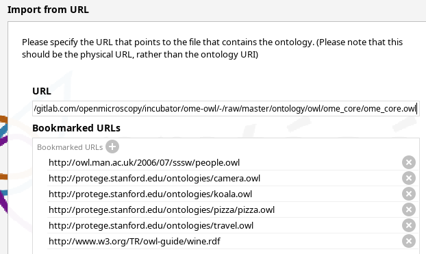
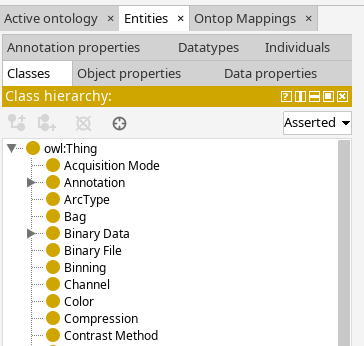
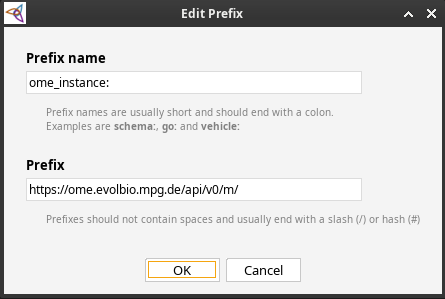
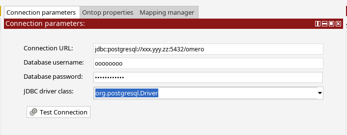
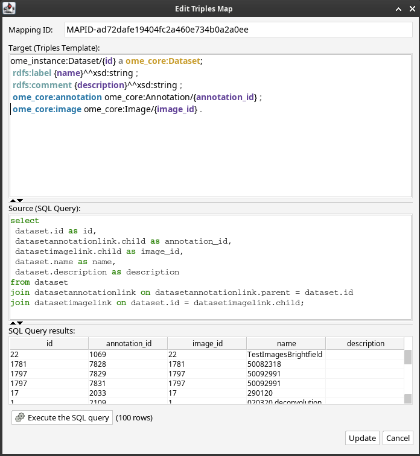
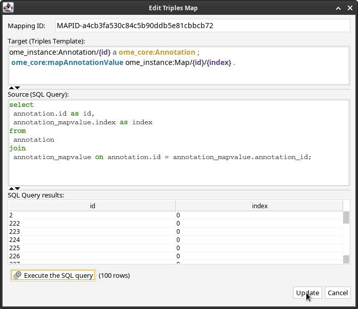
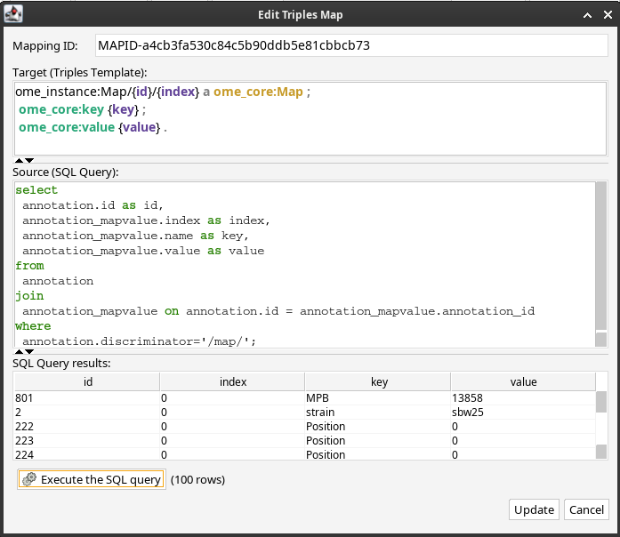

# Table of Contents

1.  [ONTOP Module for IDR on OMERO Backend](#ontop-module-for-idr-on-omero-backend)
    1.  [Acknowledgments](#acknowledgments)
    2.  [Howto Ontop](#howto-ontop)
        1.  [Software](#software)
        2.  [Configure omero postgres db](#configure-omero-postgres-db)
        3.  [Test the connection](#test-the-connection)
        4.  [Crunch time: Your first mapping](#crunch-time-your-first-mapping)
        5.  [SPARQL query](#sparql-query)
        6.  [Save mapping, ontology, and properties](#save-mapping-ontology-and-properties)
        7.  [Launch ontop SPARQL endpoint](#launch-ontop-sparql-endpoint)
        8.  [And now for something more serious](#org9483794)
        9.  [Import omecore.owl in Protege](#org9b35fbc)
        10. [Optional: Set site prefix](#orga922e8d)
        11. [Map ontology terms](#org9893393)
        12. [Mapping annotations](#orga6ebfe6)
        13. [Constructing new triples.](#orgf0d6587)

# ONTOP Module for IDR on OMERO Backend

This repository contains the ONTOP mappings and ontology for OMERO. Specialized mappings reside in subdirectories, e.g. for the IDR, MPI Evolutionary Biology, and others.

## Acknowledgments

This project was developed with support from the Biohackathon 2024.

## Howto Ontop

### Software

-   Protege: <https://protege.stanford.edu/software.php#desktop-protege>
-   Unpack on your system into a writable directory
-   Download ontop command line client (ontop-cli-x.y.z.zip) and ontop
    plugin for Protege (it.unibz.inf.ontop.protege-x.y.z.jar) from
    <https://github.com/ontop/ontop/releases/latest>
-   Unpack ontop-cli zip
-   Save ontop plugin into your Protege's plugin directory.
-   Download postgresql jdbc driver for your system's java version:
    <https://jdbc.postgresql.org/download/>
-   Save the jdbc driver into the jdbc/ subdirectory of the unpacked
    ontop-cli archive.

### Configure omero postgres db

If you run ontop on a different host than your omero instance, you have
to allow remote tcp/ip access to the latter via port 5432. By default,
this is disabled and only connections from localhost are permitted. To
this end, edit these two files (paths may vary according to host OS, on
debian/ubuntu servers it will likely be
**etc/postgresql/VERSION/main**). - *postgres.conf* either allow all
connections

    listen_addresses = '*'          # what IP address(es) to listen on;

or specify clients as comma separated values:

    listen_addresses = '192.168.1.10,172.5.16.4,localhost'          # what IP address(es) to listen on;

-   *pghba.conf* Adding these two lines worked for me but may be too
    permissive in your situation (in particular if your omero is not
    behind a firewall):

    host    all             all             0.0.0.0/0               md5
    host    all             all             ::/0                    md5

-   restart your postgres service, i.e.

    sudo service postgresql restart

### Test the connection

-   Launch Protege
-   If not present, add ontop Tabs (Menu -> Window -> Tabs -> Ontop
    Mappings)
-   Configure postgres jdbc driver:
    -   Select Menu -> File -> Preferences -> JDBC Drivers
    -   Click Add
    -   Select "org.postgresql.Driver" from Class name dropdown menu
    -   Select postgres jdbc driver jar file downloaded earlier from the
        ontop-cli jdbc directory
-   Setup connection:
    -   In the Ontop Mappings Tab, select "Connection parameters" subtab
        -   Enter connection URL:
            "jdbc:postgresql://your.omero.url:5432/omero"
        -   Enter a db username with at least read access to all tables in the
            omero db.
        -   Enter db user's password
        -   Select "org.postgresql.Driver" as JDBC driver class.
-   Click test connection
    -   On error: Check postgres config on omero host and connection
        details.
    -   On success: Hurray!

### Crunch time: Your first mapping

1.  Add entity and property to active ontology

    Add one class (e.g. `:Dataset`) and one data property (e.g. `:name`) to
    the ontology.
    
    More general, tables are mapped to classes, table index columns are
    mapped to class instances (triple subjects), table columns headers are
    mapped to properties (table predicates), table column values are mapped
    to property values (table subjects).

2.  Define mapping

    -   Select "Mapping manager" tab
    -   Click "New"
    -   Enter
    
        :dataset/{id} a :Dataset;
                      :name {name} .
    
    into the field "Target" and
    
        select id, name from dataset;
    
    into the "Source" field.
    
    You may want to test your query by clicking the "Execute the sql query"
    which will populate the "SQL Query results" field.

### SPARQL query

Select the "Ontop SPARQL" tab. Click "Prefixes" and select the base
prefix and further prefixes as needed. In the query editor enter

    select * where {
        ?subj a :Dataset;
              :name ?name .
    }

And click "Execute". Find your omero dataset ids and names in the SPARQL
results field and observe the generated SQL query in the "SQL
tranlation" tab.

### Save mapping, ontology, and properties

Select Menu -> Save (or Save as). Select "Turtle syntax" for the file
format and select a file name. This filename will serve as the basis for
three files: *.properties* (db connection settings), *.ttl* (ontology),
and *.obda* (mapping definition in ontop format).

### Launch ontop SPARQL endpoint

In a terminal, navigate to the directory where you just saved your
mapping definition files to. In that directory, run

    path/to/ontop-cli/ontop endpoint -m <filename>.obda -t <filename>.ttl -p <filename>.properties

**replace** // with the actual filename from above.

Open your webbrowser at <http://localhost:8080> where a beautiful SPARQL
frontend awaits your queries. Sparqly happy queries!

### And now for something more serious

Most likely, we do not want to work out the entire mapping ontology from scratch. Keep in mind that the omero postgresql database contains of the order 160 public tables.
This means, we would have to create of the order 160 classes and as many properties as there are columns in all tables combined. Not cool.

So instead, we will base our mapping on a existing omero ontology. ****BEWARE****
there is currently not one "the" omero ontology but a small number (somewhere
between 3 and 10) of ontologies circulate in various repositories, ontology
registries etc. Here, we employ the so called core omero ontology written by
Norio Kobayashi (@norikoba) and published in <doi:10.48550/arXiv.2110.10407>. It is maintained in
<https://gitlab.com/openmicroscopy/incubator/ome-owl.git>. The owl formatted
ontology file can be obtained from [here](https://gitlab.com/openmicroscopy/incubator/ome-owl/-/raw/master/ontology/owl/ome_core/ome_core.owl.ttl?ref_type=heads&inline=false) (gitlab download).

### Import omecore.owl in Protege

In Protege, select the "Active Ontology" tab and "Ontology imports" tab in the lower left corner. Click the (+) icon
next to "Direct Imports". In the next dialogue, select "Import an ontology contained in a document located on the web."

In the following dialogue, enter the URL <https://gitlab.com/openmicroscopy/incubator/ome-owl/-/raw/master/ontology/owl/ome_core/ome_core.owl>
into the "URL" field.

Optionally, save the URL as a bookmark for future reference.

Click "Continue" and "Finish" in the next dialogue (if the latter does not come up, check the URL).

Now select the "Entries/Classes" tab in Protege, which is now populated with all classes from the ome core ontology.

### Optional: Set site prefix

You may want to add a prefix to the ontology that sets the base part of your omero object URIs. E.g. for the IDR,
a sensible prefix could be "<http://idr.openmicroscopy.org/api/v0/m/>" In this way, the generated URIs for images, datasets,
projects, etc. would become actually valid links to the json api resources representing that object. It would also
entail the possibility to run SPARQL queries or HTTP requests against that json api resource.

In the "Active ontology" tab, select "Ontology Prefixes" in the lower left, click (+) and enter the prefix name and
URL (this example is for the MPI EB Omero instance, adjust according to your specifics).

### Map ontology terms

Let's now define our first mapping based on the imported ontology.

Select the "Ontop Mappings" tab and first enter your omero database connection parameters

adjust the settings according to your omero instance's configuration. Test your connection.

In the "Mapping manager" tab, click ["New" ](img/ONTOP_Module_for_IDR_on_OMERO_Backend/2024-10-10_15-09-28_screenshot.png).

Resuming the example made earlier [1.2.4.2](#define-mapping), enter the target as

This mapping is slightly more complex than the one above, so let's go through
the details.

The first three lines are repeated from the earlier, simple example. The
dataset's name and description are linked to the Dataset instance template via
the \`rdfs:label\` property and the \`rdfs:comment\` property, respectively. Note
that the Dataset instance is prefixed by the site prefix defined [above](#orga922e8d).
Furthermore, the type property value "omecore:Dataset" now employs the ome core
ontology instead of the "toy" ontology written from scratch in the earlier
example.

The following two lines are new. They link property values to the Dataset instance: the dataset's annotation
and the images contained in the dataset. However, this information is not provided in the postgresql database table
"dataset", so how get it?

The relation between a dataset and its images is a one-to-many relation because a given dataset
typically contains more than one image). Relational databases represent such relations through
link tables. Dataset-image relations are defined in the "datasetimagelink"
table. The Source SQL query hence \`join\`s the "dataset" table and the
"datasetimagelink" table on the "id" column from the "dataset" table and the
"parent" column from the "datasetimagelink" table. A second \`join\` on the
"datasetannotationlink" table also pulls
the dataset annotations into the sql query result. The additional column names, resulting
from the two \`join\`s can then be referred to in the the Target Triples Template in the two last lines.

Note that we also define aliases using the SQL \`as\` keyword for the templated variables to disambiguate
them in case of potentially duplicate column names in the joined tables. 

### Mapping annotations

The above example adds triples to link Datasets to their images and annotations. Let's add a few more mappings:

1.  Images

    

2.  Annotations

    

3.  Maps (aka Key-Value pairs)

    
    
    With this, we are now in the position to query key-value pairs. E.g.
    
        
            PREFIX : <https://www.openmicroscopy.org/omemap/>
            PREFIX owl: <http://www.w3.org/2002/07/owl#>
            PREFIX rdf: <http://www.w3.org/1999/02/22-rdf-syntax-ns#>
            PREFIX xml: <http://www.w3.org/XML/1998/namespace>
            PREFIX xsd: <http://www.w3.org/2001/XMLSchema#>
            PREFIX obda: <https://w3id.org/obda/vocabulary#>
            PREFIX rdfs: <http://www.w3.org/2000/01/rdf-schema#>
            PREFIX omemap: <https://www.openmicroscopy.org/omemap#>
            PREFIX ome_core: <http://www.openmicroscopy.org/rdf/2016-06/ome_core/>
            PREFIX ome_instance: <http://ome.evolbio.mpg.de/api/v0/m/>
        
        
        select distinct ?img ?key ?val where {
            ?img a ome_core:Image;
                 ome_core:annotation ?annotation .
            ?annotation ome_core:mapAnnotationValue ?map .
            ?map ome_core:key ?key;
                 ome_core:value ?val .
            }
          order by ?img
          limit 10
    
    Nice :partyingface:!

### Constructing new triples.

The previous query seeks key-value annotations for images. Imagine we wanted to query for the Strain information. In
above example we would have to filter on the "key" string, e.g. using a regular expression in a filter statement:

    
        PREFIX : <https://www.openmicroscopy.org/omemap/>
        PREFIX owl: <http://www.w3.org/2002/07/owl#>
        PREFIX rdf: <http://www.w3.org/1999/02/22-rdf-syntax-ns#>
        PREFIX xml: <http://www.w3.org/XML/1998/namespace>
        PREFIX xsd: <http://www.w3.org/2001/XMLSchema#>
        PREFIX obda: <https://w3id.org/obda/vocabulary#>
        PREFIX rdfs: <http://www.w3.org/2000/01/rdf-schema#>
        PREFIX omemap: <https://www.openmicroscopy.org/omemap#>
        PREFIX ome_core: <http://www.openmicroscopy.org/rdf/2016-06/ome_core/>
        PREFIX ome_instance: <http://ome.evolbio.mpg.de/api/v0/m/>
    
    
    select distinct ?img ?key ?val where {
        ?img a ome_core:Image;
             ome_core:annotation ?annotation .
        ?annotation ome_core:mapAnnotationValue ?map .
        ?map ome_core:key ?key;
             ome_core:value ?val .
        filter(regex(?key, "Strain"))
        }
      order by ?img
      limit 1

The more intutive query would contain a triple template of the sort
`?img :strain ?strain`, i.e. we would ask to return the "strain" property of our image.

One way to achieve this is to add new triples using the `construct` keyword:
In other words, we have to convert the property value "?key" into an instance of `rdf:type rdf:Property`.
This can be achieved by a `construct` query:

    
        PREFIX : <https://www.openmicroscopy.org/omemap/>
        PREFIX owl: <http://www.w3.org/2002/07/owl#>
        PREFIX rdf: <http://www.w3.org/1999/02/22-rdf-syntax-ns#>
        PREFIX xml: <http://www.w3.org/XML/1998/namespace>
        PREFIX xsd: <http://www.w3.org/2001/XMLSchema#>
        PREFIX obda: <https://w3id.org/obda/vocabulary#>
        PREFIX rdfs: <http://www.w3.org/2000/01/rdf-schema#>
        PREFIX omemap: <https://www.openmicroscopy.org/omemap#>
        PREFIX ome_core: <http://www.openmicroscopy.org/rdf/2016-06/ome_core/>
        PREFIX ome_instance: <http://ome.evolbio.mpg.de/api/v0/m/>
        prefix ome_instance_annotation: <http://ome.evolbio.mpg.de/api/v0/m/Annotation/>
    
    
    construct {
      ?key a rdf:Property .
      ?img ?key ?val .
        }
      where {
        ?img a ome_core:Image;
             ome_core:annotation ?annotation .
        ?annotation ome_core:mapAnnotationValue ?map .
        ?map ome_core:key ?keystr;
             ome_core:value ?val .
      bind(iri(concat("https://www.openmicroscopy.org/omemap#",str(?keystr))) as ?key)
        }
      limit 10

which results in

    @prefix : <https://www.openmicroscopy.org/omemap/> .
    @prefix owl: <http://www.w3.org/2002/07/owl#> .
    @prefix rdf: <http://www.w3.org/1999/02/22-rdf-syntax-ns#> .
    @prefix xml: <http://www.w3.org/XML/1998/namespace> .
    @prefix xsd: <http://www.w3.org/2001/XMLSchema#> .
    @prefix obda: <https://w3id.org/obda/vocabulary#> .
    @prefix rdfs: <http://www.w3.org/2000/01/rdf-schema#> .
    @prefix omemap: <https://www.openmicroscopy.org/omemap#> .
    @prefix ome_core: <http://www.openmicroscopy.org/rdf/2016-06/ome_core/> .
    @prefix ome_instance: <https://ome.evolbio.mpg.de/api/v0/m/> .
    @prefix ome_instance_annotation: <https://ome.evolbio.mpg.de/api/v0/m/Annotation/> .
    @prefix rdf4j: <http://rdf4j.org/schema/rdf4j#> .
    @prefix sesame: <http://www.openrdf.org/schema/sesame#> .
    @prefix fn: <http://www.w3.org/2005/xpath-functions#> .
    
    
    omemap:Study a rdf:Property .
    omemap:Investigation a rdf:Property .
    omemap:Strain a rdf:Property .
    omemap:Organism a rdf:Property .
    omemap:Parent a rdf:Property .
    omemap:MPB a rdf:Property .
    omemap:Author a rdf:Property .
    omemap:Type a rdf:Property .
    omemap:Assay a rdf:Property .
    
    <https://ome.evolbio.mpg.de/api/v0/m/Image/1> omemap:Study "pending";
      omemap:Investigation "pending";
      omemap:Strain "SBW25";
      omemap:Organism "Pseudomonas fluorescens";
      omemap:Parent "0";
      omemap:MPB "0";
      omemap:Author "Malavika Venu";
      omemap:Type "still";
      omemap:Assay "pending" .

